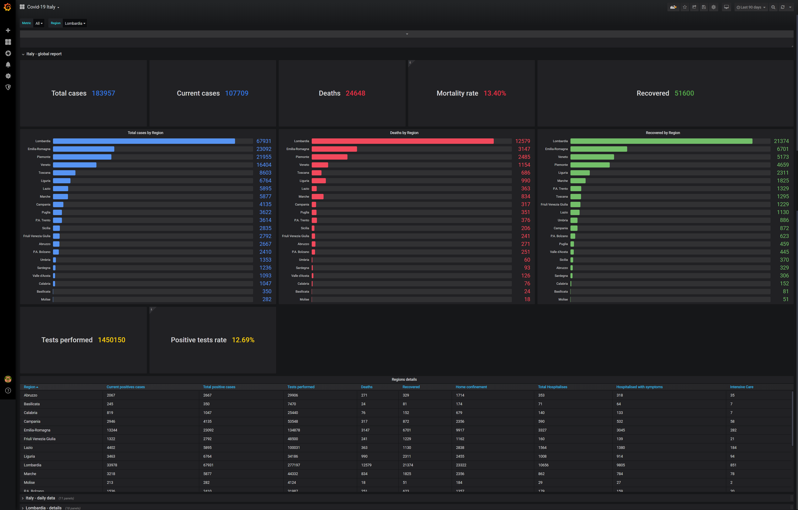
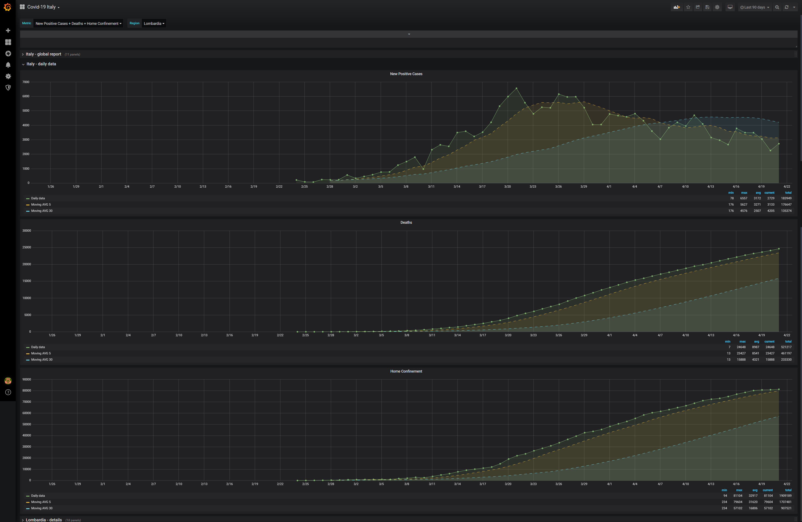
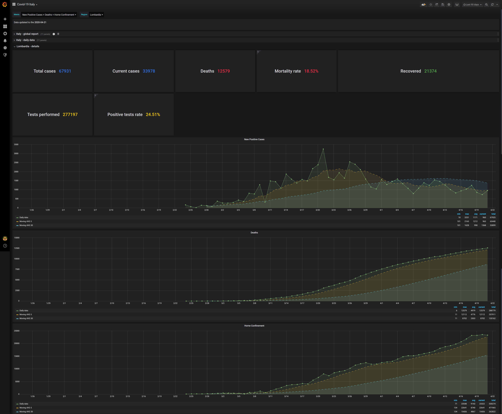

# Dashboard Covid-19 Italy
This dashboard shows data about spread of Covid-19 in Italy using the daily report published by [Dipartimento della Protezione Civile](https://github.com/pcm-dpc/COVID-19).

User can select a Region to see the details.

There a lot of metric, the user can choose a subset and plot only the required ones.
For each metric, will be shown the time series with the moving average over 5 and 30 days.

 
## Data Source
The dashboard uses SQL Server as Data Source.
In folder `SQL` you'll find the scirpt `create-db.sql` to create the DB `covid_data` and the required tables.

The folder `DataFiller` contains a dotnet console application useful to populate the DB.

You have to build it with:
```
dotnet clean
dotnet publish -c Release
```
This app downloads the latest report from the public repository and then it automatically insert the data into the SQL tables.
Please note that all previous data in thess tables will be deleted before the insert.

You can  run it with the following:
```
# USAGE
dotnet bin/Release/netcoreapp3.1/publish/DataFiller.dll [SQL_HOST] [SQL_PORT] [SQL_USER] [SQL_PASSWORD]

# EXAMPLE:
dotnet bin/Release/netcoreapp3.1/publish/DataFiller.dll localhost 1433 SA SQLserver2020 
```

## Screenshots
### Italy - Global report

### Italy - Daily details

### Region details
